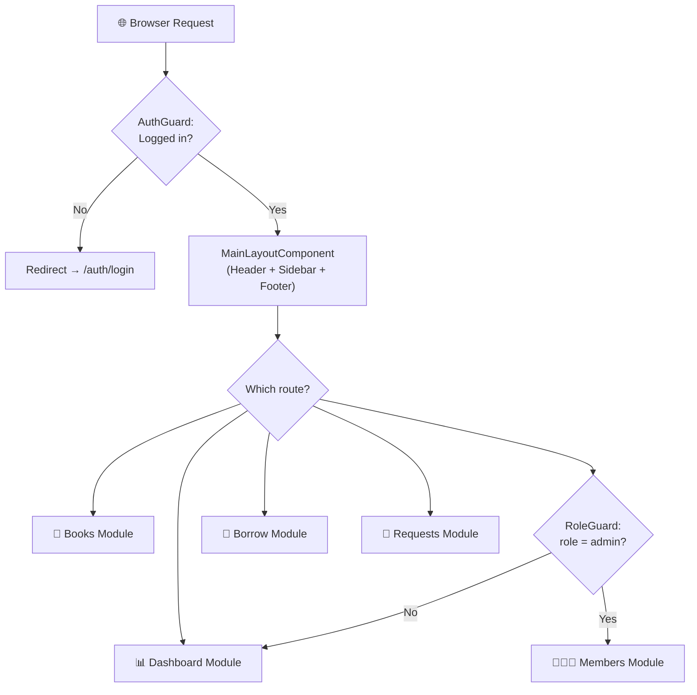
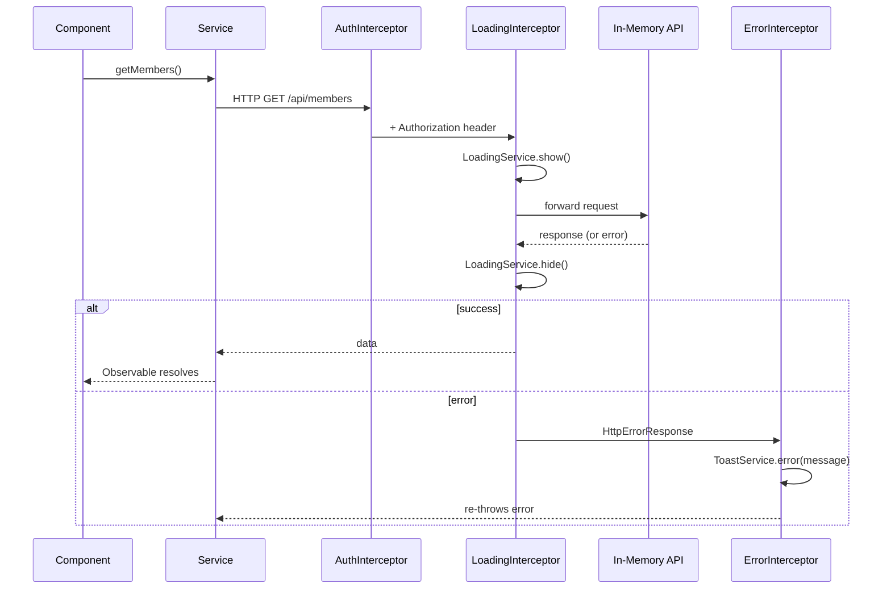
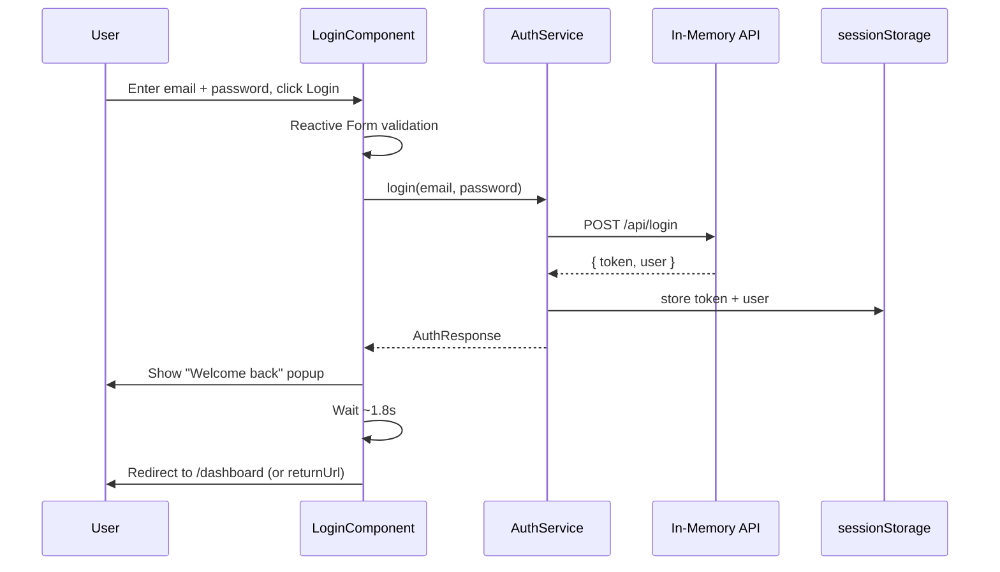

<div align="center">

# 📚 Bindery — Library Management System

### A role-based Library Management System built with Angular

*Admins manage the catalog, members, and circulation. Members browse, request, and track their own borrowing — all from one clean, responsive dashboard.*


<br>

**[Getting Started](#-getting-started)** •
**[Features](#-user-roles--permissions)** •
**[Architecture](#-application-architecture)** •
**[Modules](#-feature-modules)** •
**[Routing](#-routing-table)**

</div>

---

## 🧾 Overview

**Bindery** is a **frontend-only** Angular capstone project simulating a complete library management workflow — book cataloging, member management, book circulation (issue/return), and a member-facing request system.

There is **no real backend server**. All data is served by a simulated REST API (`angular-in-memory-web-api`) running entirely in the browser, so the whole system works out of the box with a single `npm install`.

> 💡 **Why build it this way?** It lets the entire frontend team build, test, and demo real HTTP-driven features — loading states, error toasts, validation, pagination-style filtering — without waiting on a backend team to finish an API first. Every service is written exactly as it would be against a real REST API, so swapping in a real backend later only means changing base URLs.

---

## 📑 Table of Contents

| | | |
|---|---|---|
| 🛠️ [Tech Stack](#️-tech-stack) | 🚀 [Getting Started](#-getting-started) | 🔑 [Demo Accounts](#-demo-accounts) |
| 👥 [User Roles & Permissions](#-user-roles--permissions) | 🗂️ [Project Structure](#️-project-structure) | 🏗️ [Application Architecture](#-application-architecture) |
| 🧩 [Feature Modules](#-feature-modules) | 🎨 [Shared Module](#-shared-module) | 📦 [Data Models](#-data-models) |
| ⚙️ [Services Layer](#️-services-layer) | 🛡️ [Route Guards](#️-route-guards) | 🔌 [HTTP Interceptors](#-http-interceptors) |
| 🗄️ [Simulated Backend](#️-simulated-backend-in-memory-api) | 🧭 [Routing Table](#-routing-table) | 🔐 [Auth Flow Diagram](#-authentication-flow) |
| ✨ [Notable Implementation Details](#-notable-implementation-details) | 📜 [Available Scripts](#-available-scripts) | 🧭 [Roadmap](#-known-limitations--roadmap) |

---

## 🛠️ Tech Stack

| Layer | Technology | Notes |
|---|---|---|
| **Framework** | Angular 18 | Uses classic `NgModules`, not standalone components |
| **Language** | TypeScript 5.5 | Strict interfaces for every data model |
| **Reactive programming** | RxJS 7.8 | `Observable`, `BehaviorSubject`, `tap`, `finalize`, `catchError` |
| **Forms** | Angular Reactive Forms | `FormBuilder`, `Validators`, pattern-based validation |
| **HTTP** | `HttpClient` | Centralized in per-domain services |
| **Simulated backend** | `angular-in-memory-web-api` | Full REST simulation, zero real server needed |
| **Auth** | JWT-style token simulation | Stored in `sessionStorage`, attached via interceptor |
| **Route protection** | Angular Route Guards | `AuthGuard`, `RoleGuard` |
| **Cross-cutting concerns** | HTTP Interceptors | Auth header, global loading spinner, error → toast |
| **Styling** | Component-scoped CSS | No external UI framework |
| **Testing** | Karma + Jasmine | Angular CLI default test runner |

---

## 🚀 Getting Started

### Prerequisites
- ✅ Node.js (LTS recommended)
- ✅ Angular CLI — `npm install -g @angular/cli` *(optional — `npx` also works)*

### Installation

```bash
# 1. Install dependencies
npm install

# 2. Run the dev server
npm start
```

The app boots at **http://localhost:4200** 🎉

> No `.env` file, no database connection string, no backend to spin up — the simulated API seeds itself automatically on first load.

---

## 🔑 Demo Accounts

| Role | Email | Password |
|---|---|---|
| 🛡️ **Admin** | `admin@library.com` | `admin123` |
| 👤 **Member** | `member@library.com` | `member123` |

> The login screen has **one-click "fill demo account" buttons** for both roles — no need to type credentials manually while testing or demoing.

---

## 👥 User Roles & Permissions

<table>
<tr><th width="50%">🛡️ Admin</th><th width="50%">👤 Member</th></tr>
<tr valign="top">
<td>

- Full access to the entire system
- ✅ Add / edit / delete **books**
- ✅ Add / edit / delete **members**
- ✅ Issue books and process returns
- ✅ Approve / reject borrow requests
- ✅ Approve / reject new-book requests
- ✅ View system-wide dashboard stats

</td>
<td>

- View the book catalog (read-only)
- ✅ Request to borrow a book
- ✅ Request a new book be added
- ✅ View own borrow / return history
- ✅ View a personal dashboard summary
- ❌ Cannot manage members
- ❌ Cannot edit the catalog directly

</td>
</tr>
</table>

Role-based access is enforced everywhere using **`RoleGuard`** combined with route `data.roles` configuration — see [Route Guards](#️-route-guards).

---

## 🗂️ Project Structure

```
library-management-system/
├── src/
│   ├── app/
│   │   ├── auth/                       🔓 Login feature (lazy-loaded, public)
│   │   │   ├── login/
│   │   │   ├── auth.module.ts
│   │   │   └── auth-routing.module.ts
│   │   │
│   │   ├── dashboard/                  📊 Overview stats + recent activity
│   │   │   ├── dashboard-home/
│   │   │   ├── dashboard.module.ts
│   │   │   └── dashboard-routing.module.ts
│   │   │
│   │   ├── books/                      📖 Book catalog CRUD + search
│   │   │   ├── book-list/
│   │   │   ├── book-form/
│   │   │   ├── books.module.ts
│   │   │   └── books-routing.module.ts
│   │   │
│   │   ├── members/                    🧑‍🤝‍🧑 Member CRUD + search (admin-only)
│   │   │   ├── member-list/
│   │   │   ├── member-form/
│   │   │   ├── members.module.ts
│   │   │   └── members-routing.module.ts
│   │   │
│   │   ├── borrow/                     🔄 Issue / return workflow, overdue detection
│   │   │   ├── borrow-list/
│   │   │   ├── borrow-request-form/
│   │   │   ├── borrow-approvals/
│   │   │   ├── borrow.module.ts
│   │   │   └── borrow-routing.module.ts
│   │   │
│   │   ├── requests/                   📝 Member-raised requests (new book / borrow)
│   │   │   ├── request-list/
│   │   │   ├── request-form/
│   │   │   ├── requests.module.ts
│   │   │   └── requests-routing.module.ts
│   │   │
│   │   ├── shared/                     🎨 Reusable UI, used app-wide
│   │   │   ├── header/
│   │   │   ├── sidebar/
│   │   │   ├── footer/
│   │   │   ├── layout/                  (MainLayoutComponent — page shell)
│   │   │   ├── loading-spinner/
│   │   │   ├── toast/
│   │   │   ├── confirm-dialog/
│   │   │   ├── filter-by.pipe.ts        (live search/filter pipe)
│   │   │   └── shared.module.ts
│   │   │
│   │   ├── services/                    ⚙️ Business logic + API communication
│   │   │   ├── auth.service.ts
│   │   │   ├── book.service.ts
│   │   │   ├── member.service.ts
│   │   │   ├── borrow.service.ts
│   │   │   ├── borrow-request.service.ts
│   │   │   ├── book-request.service.ts
│   │   │   ├── toast.service.ts
│   │   │   ├── loading.service.ts
│   │   │   └── in-memory-data.service.ts   (simulated backend + seed data)
│   │   │
│   │   ├── guards/
│   │   │   ├── auth.guard.ts             🔐 must be logged in
│   │   │   └── role.guard.ts             🛡️ must have the right role
│   │   │
│   │   ├── interceptors/
│   │   │   ├── auth.interceptor.ts        🔑 attaches JWT-style token
│   │   │   ├── loading.interceptor.ts     ⏳ drives the global spinner
│   │   │   └── error.interceptor.ts       ⚠️ turns failures into toasts
│   │   │
│   │   ├── models/                       📦 TypeScript interfaces (data contracts)
│   │   │   ├── user.model.ts
│   │   │   ├── book.model.ts
│   │   │   ├── member.model.ts
│   │   │   ├── borrow-record.model.ts
│   │   │   ├── borrow-request.model.ts
│   │   │   └── book-request.model.ts
│   │   │
│   │   ├── app.component.ts / .html / .css
│   │   ├── app.module.ts                 Root module — interceptors, in-memory API
│   │   └── app-routing.module.ts         Root routes — wires up all feature modules
│   │
│   ├── index.html
│   ├── main.ts
│   └── styles.css
│
├── angular.json
├── package.json
├── tsconfig.app.json / tsconfig.spec.json
└── README.md
```

---

## 🏗️ Application Architecture

- **NgModules, not standalone components** — every feature (Auth, Dashboard, Books, Members, Borrow, Requests) is its own Angular module with its own routing module.
- **Lazy loading everywhere** — the root router loads every feature module on demand via `loadChildren`, so the browser only downloads code for the page currently being visited.
- **Layout shell pattern** — all authenticated pages render inside `MainLayoutComponent` (header + sidebar + footer + `<router-outlet>`). The `auth` module sits outside this shell since login doesn't need the app chrome.
- **Central services, dumb components** — components never call `HttpClient` directly; every API call goes through a dedicated service, keeping API logic in one place per domain.
- **One shared module for reusable UI** — header, sidebar, footer, toast, spinner, confirm dialog, and the `filterBy` pipe live in `SharedModule`, imported wherever needed.



---

## 🧩 Feature Modules

### 1️⃣ Auth Module
**Route:** `/auth/login` &nbsp;·&nbsp; Public, lazy-loaded, sits outside the main layout

<details>
<summary><b>📋 Full details</b></summary>
<br>

Handles user login using Angular Reactive Forms.

- Email + password fields, validated with `Validators.required`, `Validators.email`, and `Validators.minLength(6)` on the password.
- **"Fill demo account" buttons** instantly populate the form with either the admin or member demo credentials.
- On submit, calls `AuthService.login()`, sending a `POST` request to `/api/login`.
- On success: token + user object are stored in `sessionStorage`, a short **"Welcome back"** popup appears, and the user is auto-redirected — either to `/dashboard`, or to a `returnUrl` if they were bounced here from a protected page.
- On failure: the submit button re-enables so the user can try again, and `ErrorInterceptor` surfaces the failure as a toast.

</details>

### 2️⃣ Dashboard Module
**Route:** `/dashboard` &nbsp;·&nbsp; Protected — any logged-in user

<details>
<summary><b>📋 Full details</b></summary>
<br>

The landing page after login. Shows an overview relevant to the logged-in role — summary counts (total books, total members, active borrows, overdue count for admins) and recent activity.

</details>

### 3️⃣ Books Module
**Route:** `/books` &nbsp;·&nbsp; Protected

<details>
<summary><b>📋 Full details</b></summary>
<br>

Manages the book catalog.

- **📋 Book List** — table of all books (title, author, genre, total quantity, available copies), with live search/filter, and Edit/Delete actions for admins.
- **📝 Book Form** — one reusable component for both **Add Book** and **Edit Book**, following the same "check the route for an `id`" pattern used across the app.
- `BookService` exposes `getBooks()`, `getBook(id)`, `addBook()`, `updateBook()`, `deleteBook()`.
- The `available` count on a book is automatically adjusted whenever a book is issued or returned.

</details>

### 4️⃣ Members Module
**Route:** `/members` &nbsp;·&nbsp; Protected, **admin only** 🛡️

<details>
<summary><b>📋 Full details</b></summary>
<br>

Manages library members — this is the module covered in depth in the companion presentation notes.

- **📋 Member List** — table of all members (ID, name, email, phone, joined date) with a live search box (filters by name/email as-you-type) and Edit/Delete actions. Delete requires confirmation via `app-confirm-dialog` before hitting the backend.
- **📝 Member Form** — one reusable component for both **Add Member** (Registration) and **Edit Member**, deciding its mode from whether the route contains an `:id`. Built with Reactive Forms:

  | Field | Rules |
  |---|---|
  | `name` | required |
  | `email` | required, valid email format |
  | `phone` | required, exactly 10 digits (`/^[0-9]{10}$/`) |

- `MemberService` exposes `getMembers()`, `getMember(id)`, `addMember()`, `updateMember()`, `deleteMember()`.
- Every route has `canActivate: [RoleGuard]` with `data: { roles: ['admin'] }` — members with the `member` role are redirected to `/dashboard` if they try to access these URLs directly.

</details>

### 5️⃣ Borrow Module
**Route:** `/borrow` &nbsp;·&nbsp; Protected

<details>
<summary><b>📋 Full details</b></summary>
<br>

Handles the actual circulation of books.

- **🔄 Borrow List** — all borrow records with issue date, due date, return date, and status (`Issued`, `Returned`, or `Overdue`). Overdue status is computed **client-side** by comparing each record's due date against today.
- **📝 Borrow Request Form** — used by members to request borrowing a specific book.
- **✅ Borrow Approvals** — admin-only screen to review pending borrow/return requests and approve or reject them.
- `BorrowService` exposes `getRecords()`, `issueBook()`, `returnBook()`.
- `BorrowRequestService` exposes `getRequests()`, `addRequest()`, `updateRequest()`, `deleteRequest()`.

</details>

### 6️⃣ Requests Module
**Route:** `/requests` &nbsp;·&nbsp; Protected

<details>
<summary><b>📋 Full details</b></summary>
<br>

A general request center for members — e.g. requesting a new book title be added to the library.

- **📋 Request List** — all requests with their status (`Pending`, `Approved`, `Rejected`).
- **📝 Request Form** — form for a member to submit a new book request (title, author, reason).
- `BookRequestService` exposes `getRequests()`, `addRequest()`, `updateRequest()`, `deleteRequest()`.

</details>

---

## 🎨 Shared Module

Located at `src/app/shared/`, imported by every feature module that needs common UI pieces.

| Component / Pipe | Purpose |
|---|---|
| 🧭 `HeaderComponent` | Top bar — shows logged-in user info and a logout action (with a brief "logging out…" overlay before redirecting) |
| 📂 `SidebarComponent` | Left navigation menu; items can be flagged `adminOnly` to hide them from member accounts |
| 🦶 `FooterComponent` | Simple footer with the current year |
| 🖼️ `MainLayoutComponent` | Page shell (header + sidebar + footer + `<router-outlet>`) wrapping all authenticated routes |
| ⏳ `LoadingSpinnerComponent` | Global spinner, shown/hidden automatically by `LoadingInterceptor` during HTTP calls |
| 🔔 `ToastComponent` | Success/error notification popups, driven by `ToastService` |
| ❓ `ConfirmDialogComponent` | Reusable "Are you sure?" confirmation modal before destructive actions like delete |
| 🔍 `FilterByPipe` (`filterBy`) | Custom pipe for live, client-side search — filters an array of objects against a list of field names |

---

## 📦 Data Models

All models live in `src/app/models/` as TypeScript interfaces — defining the exact shape every object must have, catching mismatched or missing fields at **compile time**, before the app even runs.

<details>
<summary><b>👤 <code>user.model.ts</code></b></summary>

```typescript
export type UserRole = 'admin' | 'member';

export interface User {
  id: number;
  name: string;
  email: string;
  password: string;
  role: UserRole;
}

export interface AuthResponse {
  token: string;
  user: Omit<User, 'password'>;
}
```
</details>

<details>
<summary><b>📖 <code>book.model.ts</code></b></summary>

```typescript
export interface Book {
  id: number;
  title: string;
  author: string;
  genre: string;
  quantity: number;
  available: number;
}
```
</details>

<details>
<summary><b>🧑‍🤝‍🧑 <code>member.model.ts</code></b></summary>

```typescript
export interface Member {
  id: number;
  name: string;
  email: string;
  phone: string;
  joinedDate: string;
}
```
</details>

<details>
<summary><b>🔄 <code>borrow-record.model.ts</code></b></summary>

```typescript
export interface BorrowRecord {
  id: number;
  bookId: number;
  bookTitle: string;
  memberId: number;
  memberName: string;
  issueDate: string;
  dueDate: string;
  returnDate: string | null;
  status: 'Issued' | 'Returned' | 'Overdue';
  fine?: number;
}
```
</details>

<details>
<summary><b>📨 <code>borrow-request.model.ts</code></b></summary>

```typescript
export type BorrowRequestType = 'Borrow' | 'Return';
export type BorrowRequestStatus = 'Pending' | 'Approved' | 'Rejected';

export interface BorrowRequest {
  id: number;
  type: BorrowRequestType;
  bookId: number;
  bookTitle: string;
  memberId: number;
  memberName: string;
  requestDate: string;
  issueDate?: string;
  dueDate?: string;
  borrowRecordId?: number;
  status: BorrowRequestStatus;
}
```
</details>

<details>
<summary><b>📝 <code>book-request.model.ts</code></b></summary>

```typescript
export interface BookRequest {
  id: number;
  title: string;
  author?: string;
  reason?: string;
  memberId: number;
  memberName: string;
  requestDate: string;
  status: 'Pending' | 'Approved' | 'Rejected';
}
```
</details>

---

## ⚙️ Services Layer

Every domain has exactly **one** `@Injectable({ providedIn: 'root' })` service responsible for all HTTP communication for that domain. Components call these services; they never call `HttpClient` directly — a pattern known as **separation of concerns**.

| Service | Base URL | Methods |
|---|---|---|
| 🔐 `AuthService` | `/api/login` | `login()`, `logout()`, `getToken()`, `isLoggedIn()`, `getRole()`, `currentUser$` |
| 📖 `BookService` | `/api/books` | `getBooks()`, `getBook(id)`, `addBook()`, `updateBook()`, `deleteBook()` |
| 🧑‍🤝‍🧑 `MemberService` | `/api/members` | `getMembers()`, `getMember(id)`, `addMember()`, `updateMember()`, `deleteMember()` |
| 🔄 `BorrowService` | `/api/borrowrecords` | `getRecords()`, `issueBook()`, `returnBook()` |
| 📨 `BorrowRequestService` | `/api/borrowrequests` | `getRequests()`, `addRequest()`, `updateRequest()`, `deleteRequest()` |
| 📝 `BookRequestService` | `/api/bookrequests` | `getRequests()`, `addRequest()`, `updateRequest()`, `deleteRequest()` |
| 🔔 `ToastService` | — | `success(message)`, `error(message)` |
| ⏳ `LoadingService` | — | `show()`, `hide()` |

> `AuthService` tracks the logged-in user with an RxJS `BehaviorSubject` (`currentUser$`) — any component can subscribe and reactively know who's logged in and their role, without re-reading storage every time.

---

## 🛡️ Route Guards

Located in `src/app/guards/`.

### `AuthGuard` — "Are you logged in at all?"
```typescript
canActivate(route, state): boolean | UrlTree {
  if (this.auth.isLoggedIn()) {
    return true;
  }
  return this.router.createUrlTree(['/auth/login'], { queryParams: { returnUrl: state.url } });
}
```
Wraps the entire authenticated part of the app. No valid session → redirect to `/auth/login`, preserving the originally requested URL as `returnUrl` so the user lands back there right after logging in.

### `RoleGuard` — "Do you have the right role?"
```typescript
canActivate(route): boolean | UrlTree {
  const allowedRoles = route.data['roles'];
  const role = this.auth.getRole();
  if (!allowedRoles || (role && allowedRoles.includes(role))) {
    return true;
  }
  return this.router.createUrlTree(['/dashboard']);
}
```
Applied on routes needing role restriction (all three Members routes use `data: { roles: ['admin'] }`). Wrong role → redirected to `/dashboard` instead of seeing the restricted page.

---

## 🔌 HTTP Interceptors

Located in `src/app/interceptors/`, registered in `app.module.ts` via `HTTP_INTERCEPTORS`. They run automatically on **every** outgoing HTTP request/response.

| Interceptor | What it does |
|---|---|
| 🔑 `AuthInterceptor` | Reads the token from `AuthService` and attaches it as an `Authorization: Bearer <token>` header |
| ⏳ `LoadingInterceptor` | Calls `LoadingService.show()` when a request starts, `.hide()` when it finishes — powers the global spinner |
| ⚠️ `ErrorInterceptor` | Catches failed requests, extracts a message, and shows it via `ToastService.error()` automatically |



---

## 🗄️ Simulated Backend (In-Memory API)

`src/app/services/in-memory-data.service.ts` uses `angular-in-memory-web-api` to simulate a real REST backend entirely in the browser (data persists in `localStorage`). Registered in `app.module.ts`:

```typescript
HttpClientInMemoryWebApiModule.forRoot(InMemoryDataService, {
  delay: 300,
  apiBase: 'api/',
  passThruUnknownUrl: true
})
```

| Config | Purpose |
|---|---|
| `delay: 300` | Adds a small artificial delay to every response so loading spinners are actually visible during dev instead of resolving instantly |
| `apiBase: 'api/'` | All requests routed through this base path |
| `passThruUnknownUrl: true` | Any URL not matching a known collection passes through untouched |

- Seeds initial data for `users`, `books`, `members`, `borrowrecords`, `bookrequests`, and `borrowrequests` on first run, and persists changes across reloads.
- Intercepts the custom `/api/login` endpoint and checks credentials against the seeded `users` array, simulating a real authentication flow.
- Because every service is written against normal `HttpClient` + REST URL conventions, swapping this for a real backend later only requires changing base URLs — **zero component code changes needed**.

---

## 🧭 Routing Table

| Path | Module | Guard(s) | Access |
|---|---|---|---|
| `/auth/login` | Auth | — | 🌍 Public |
| `/dashboard` | Dashboard | `AuthGuard` | 🔓 Any logged-in user |
| `/books` | Books | `AuthGuard` | 🔓 Any logged-in user *(edit/delete restricted to admin in UI)* |
| `/books/new` | Books | `AuthGuard` | 🛡️ Admin |
| `/books/:id/edit` | Books | `AuthGuard` | 🛡️ Admin |
| `/members` | Members | `AuthGuard`, `RoleGuard` | 🛡️ Admin only |
| `/members/new` | Members | `AuthGuard`, `RoleGuard` | 🛡️ Admin only |
| `/members/:id/edit` | Members | `AuthGuard`, `RoleGuard` | 🛡️ Admin only |
| `/borrow` | Borrow | `AuthGuard` | 🔓 Any logged-in user |
| `/requests` | Requests | `AuthGuard` | 🔓 Any logged-in user |
| `**` *(anything else)* | — | — | ↪️ Redirects to `/` → `/dashboard` |

---

## 🔐 Authentication Flow



---

## ✨ Notable Implementation Details

- 📅 **Overdue detection** is computed client-side in `BorrowListComponent` by comparing each record's `dueDate` against today's date — no server-side cron job; it recalculates on every render.
- 🔁 **Book availability sync** — issuing or returning a book automatically increments/decrements that book's `available` count via `BookService.updateBook()`, keeping catalog numbers accurate without a manual admin step.
- 🔍 **Live search & filter** — the custom `filterBy` pipe (used on both Books and Members lists) filters records by the fields you pass it, updating instantly as the user types, with no search button and no page reload.
- 🔔 **Global notifications** — `ToastService` + `ErrorInterceptor` mean success/error messages appear consistently app-wide, without individual components needing to know about each other.
- 📝 **Reusable Add/Edit forms** — Books and Members modules both use a single form component for create and update, switching mode based on whether the current route contains an `:id`.
- ❓ **Confirm-before-delete** — deleting a book or member always opens `ConfirmDialogComponent` first; the delete API call only fires on confirmation, preventing accidental data loss.
- 🔒 **Session handling** — login state is a JWT-style token simulation kept in `sessionStorage` (cleared automatically when the browser tab closes), not `localStorage`, so sessions don't silently persist forever.

---

## 📜 Available Scripts

```bash
npm start      # ng serve — dev server at http://localhost:4200
npm run build  # ng build — production build → dist/
npm run watch  # ng build --watch --configuration development
npm test       # ng test — unit tests via Karma + Jasmine
```

---

## 🏗️ Building for Production

```bash
npm run build
```

Compiled output is written to `dist/library-management-system/browser`, ready to deploy to any static file host (Netlify, Vercel, GitHub Pages, Nginx, etc.) — the entire backend is simulated client-side, so there's nothing else to configure.

---

## 🧭 Known Limitations / Roadmap

- [ ] No real backend/database — all data resets if `localStorage` is cleared, since it's a simulated API for development and demo purposes.
- [ ] No dedicated read-only **Member Details** page yet — admins currently view/edit member info through the same Edit Member form; a separate profile-style view (with borrow history) is a natural next step.
- [ ] No dedicated **Student/Member self-profile** page yet — a logged-in member doesn't have a single page showing just their own profile; this would reuse the existing `MemberService` and `AuthService.currentUser$`.
- [ ] Fines (`BorrowRecord.fine`) are modeled in the data but not yet calculated or displayed anywhere in the UI.
- [ ] No password reset / forgot-password flow — only the two seeded demo accounts exist.

---

<div align="center">

Made with 💜 in Angular · A capstone project for learning role-based frontend architecture

</div>
